# Table of Contents

* [ETAI Library - Tutorial](#etai-library---tutorial)
  * [Introduction](#introduction)
  * [Interface Extraction](#interface-extraction)
    * [Overview](#overview)
    * [Basic Usage of Interface Extraction](#basic-usage-of-interface-extraction)
    * [Adapt Interface Extraction](#adapt-interface-extraction)
    * [Behavior of Interface Extraction in Hierarchies](#behavior-of-interface-extraction-in-hierarchies)
  * [Automatic Adaption of Classes](#automatic-adaption-of-classes)
    * [Overview](#overview-1)
    * [Generate the Implementation of Methods/Constructors](#generate-the-implementation-of-methodsconstructors)
    * [Adapt Types of Constructor/Method Parameters and Return Types](#adapt-types-of-constructormethod-parameters-and-return-types)
    * [Reimplement Constructors](#reimplement-constructors)
    * [Deactivate and Change Adaption Rules](#deactivate-and-change-adaption-rules)
    * [Use Adaption Variables](#use-adaption-variables)
    * [Generate Factory Methods](#generate-factory-methods)
      * [Initialization after Object has been Constructed Completely](#initialization-after-object-has-been-constructed-completely)
    * [Generate Factories](#generate-factories)
    * [Adaption Rule Specification](#adaption-rule-specification)
      * [Adaption Functions](#adaption-functions)
      * [Predefined Adaption Variables](#predefined-adaption-variables)
      * [Adaption Function: *alternative*](#adaption-function-alternative)
  * [Default Implementation](#default-implementation)
    * [Overview](#overview-2)
    * [Basic Usage of Default Implementation](#basic-usage-of-default-implementation)
  * [Traits](#traits)
    * [Overview](#overview-3)
    * [Basic Usage of Trait Classes](#basic-usage-of-trait-classes)
    * [Exclusive Methods](#exclusive-methods)
    * [Required Methods](#required-methods)
    * [Processed Methods](#processed-methods)
      * [Standard Trait Method Processors](#standard-trait-method-processors)
      * [Implement Own Trait Method Processor](#implement-own-trait-method-processor)
    * [Envelope Methods](#envelope-methods)
      * [Default Value Provider](#default-value-provider)
    * [Additional Flags for Trait Methods](#additional-flags-for-trait-methods)
      * [Flag: *required*](#flag-required)
      * [Flag: *setFinal*](#flag-setfinal)
    * [Redirection of Trait Methods](#redirection-of-trait-methods)
    * [Constructor Methods and Construction Process](#constructor-methods-and-construction-process)
      * [Automatic Generation of Constructors](#automatic-generation-of-constructors)
    * [*this* within Trait Classes](#this-within-trait-classes)
      * [Calling Methods inside of Trait Classes](#calling-methods-inside-of-trait-classes)
      * [Usage of *$extendedThis*](#usage-of-extendedthis)
    * [Trait Classes and Inheritance](#trait-classes-and-inheritance)
      * [Calling Trait Methods of Parent Class within Trait Classes](#calling-trait-methods-of-parent-class-within-trait-classes)
      * [Base Trait Classes](#base-trait-classes)
      * [Trait Classes using Trait Classes](#trait-classes-using-trait-classes)

# ETAI Library - Tutorial

## Introduction

The ETAI library contains several [Active Annotations for Xtend](https://eclipse.org/xtend/documentation/204_activeannotations.html). The major purpose of the provided Active Annotations is to avoid boilerplate code by providing different means. These means include the automatic **extraction** of interfaces from classes, an extension mechanism for classes by methods of so-called **trait** classes, and the automatic **adaption** and **implementation** of methods and constructors in derived classes. Based on these keywords, this Active Annotation library is called ETAI.

## Interface Extraction

### Overview

Interface Extraction is a small, but very useful feature of the ETAI library. It can **automatically extract an interface** (also called **mirror interface** in this context) for a given class. For this, the class just has to be annotated by ***@ExtractInterface***. Of course, the interface extraction supports some options to adjust the concrete behavior.

Defining and working with interfaces is very important in modern software development. The separation of implementation and interface will help to manage software complexity and especially offer flexibility in later project stages. Algorithms shall rather work on basis of abstract objects with a defined interface instead of concrete ones.

For many types of software components it is very hard to define interfaces in early phases and prototyping. Such interfaces will not be stable during the development process. This results in work overhead, because both implementation and interface must be maintained. Therefore, a meaningful usage of interfaces is even omitted at this point in time, so creating and using interfaces will cause work in refactoring phases.

Extracting interfaces automatically in early project stages will solve this problem. If necessary, interface and implementation can be decoupled in later phases by writing the interface manually. There is no real overhead for the programmer until then.

Interface Extraction is already available as an example of Xtend's Active Annotation abilities (see [\@Extract](https://www.eclipse.org/xtend/documentation/204_activeannotations.html)). However, the interface extraction implementation within the ETAI library supports a broader amount of Java constructs and offers slightly more features. Generics are fully supported, for example. In addition, it is smoothly working together with other ETAI features.
				
### Basic Usage of Interface Extraction

In the following example a simple interface extraction is used. The annotation ***@ExtractInterface*** is applied to a class called *Lion*. Therefore, a mirror interface *ILion* is generated automatically. By default, this interface is located in a sub package called *intf*. The name of the interface or sub package can be influenced by options as shown in the latter examples (see [Adapt Interface Extration](#adapt-interface-extraction)).

The generated mirror interface *ILion* gets all ***public*** methods (abstract and non-abstract) of *Lion* by default. Also Javadoc comments of the methods in *Lion* will be copied to the interface. Non-public methods will not show up in the interface. Finally, the class *Lion* will be adapted in order to implement the interface *ILion*.

##### Input (Code)

```java
package virtual

import org.eclipse.xtend.lib.annotation.etai.ExtractInterface

@ExtractInterface
class Lion {

	private def String noise() {
		"Roar!"
	}
	
	override void roar(intensity : int) {
		for (i : 0 ..< intensity)
			System.out.println('''«noise()»''');
	}

}
```


##### Input (Diagram)

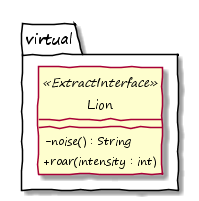

##### Output (Diagram)

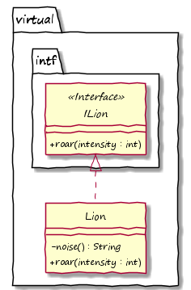

##### Important

> Please note, that methods which shall be extracted must already be declared with ***override*** not *def*, even if they do not show up in any base class or another interface. This is due to the fact that the generated mirror interface which contains the method must already be assumed.

##### Limitations

> A class using *@ExtractInterface* must **not be placed in the default package**.
>
> It is also necessary to explicitly define all types for methods, because **types cannot be inferred for the extraction process**.

### Adapt Interface Extraction

There are two possibilities to influence the extraction of the mirror interface. Firstly, methods can be excluded, i.e., they will not become part of the extracted interface. Secondly, it can be specified how the name of the extracted interface is generated and in which package it is put.

If a *public* method shall not be placed in the mirror interface, it must be annotated by ***@NoInterfaceExtract***.

In order to influence the name and package of the mirror interface the parameter ***name*** of the *@ExtractInterface* annotation must be set. This parameter is also available for *@TraitClass*.

The value of *name* must be a string and can be considered as *naming rule*:

* If the naming rule does not contain any special character, the string represents the fully qualified name of the mirror interface.
* If the naming rule starts with a *"#"* symbol, it contains a relative prefix. For example, if *name* is set to *"#subpack.I"* for a class *mainpack.Foo*, the mirror interface will be generated in a package called *mainpack.subpack* and the mirror interface's name will be *IFoo*. If the class is an inner class, the mirror interface will be in the same enclosing class.
* If the naming rule starts with a *"@"* symbol, it contains an absolute prefix. For example, if *name* is set to *"@apack.I"* for a class *mainpack.Foo*, the mirror interface will be generated in a package called *apack* and the interface's name will be *IFoo*.

The default value (applied if nothing is set) of *name* is *"#intf.I"*, so the mirror interface is put into a sub package *intf* (relative to the annotated class) and has the prefix *"I"*.

The following example shows how both the usage of *@NoInterfaceExtract* and setting *name* to specific values.

##### Input (Code)

```java
package virtual

import org.eclipse.xtend.lib.annotation.etai.ExtractInterface
import org.eclipse.xtend.lib.annotation.etai.NoInterfaceExtract

import external.IAnimal

@ExtractInterface(name = "external.IAnimal")
class Animal { 
}

@ExtractInterface(name = "#internal.")
class Dog implements IAnimal {
	
	override void bark() { /* ... */ }
	
	@NoInterfaceExtract
	def void bite() { /* ... */ }
	 
}
```


##### Input (Diagram)

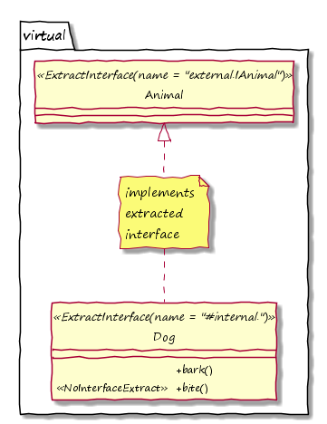

##### Output (Diagram)

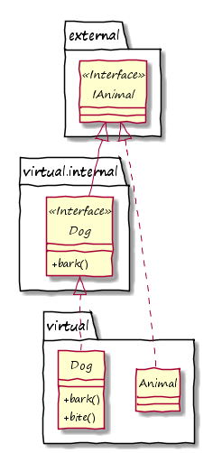

##### Limitations

*@NoInterfaceExtract* cannot be used within trait classes, for which also an interface is extracted (cp. [Basic Usage of Trait Classes](#basic-usage-of-trait-classes)).

### Behavior of Interface Extraction in Hierarchies

The extraction of mirror interfaces also takes the **type hierarchy** of the class with *@ExtractInterface* annotation into account. For example, the implemented interfaces of the annotated class will also be the base for the mirror interface.

In addition, **methods of parent classes and their implemented interfaces** are processed as if they were in the annotated class. A recursive algorithm takes care that also elements in parents are extracted. It can stop, however, if another parent class with *@ExtractInterface* annotation is found.

The example below shows this. The extracted mirror interface *IMammal* extends *IAnimal*, because this has been defined for *Mammal*. Another showcase is the mirror interface *ILion*. In this case, *Lion* does not directly define implemented interfaces. However, its base class *BigCat* does implement *ILargeAnimal*, which is why *ILion* is extending this interface. In addition, *ILion* is extending *ICat*, because *Cat* is a parent class of *Lion*. Because *ICat* itself is a mirror interface, *ILion* can rely on extraction mechanisms and does not need to extend another interface deeper in the class hierarchy.

In a similar way, the class structure is analyzed for defining methods in the mirror interfaces. For example, *ILion* contains method *hintInPack*, because it is defined within *Lion*. It also contains method *roar*, because it is defined in its parent class *BigCat*. On the other side, it does not contain method *getHome*, because it is already contained in mirror interface *IAnimal*. The same applies for method *feed*, which is in mirror interface *IMammal*.

##### Input (Code)

```java
package virtual

import org.eclipse.xtend.lib.annotation.etai.ExtractInterface

@ExtractInterface
abstract class Mammal implements IAnimal {
	override void feed() { /* ... */ }
}

@ExtractInterface
abstract class Cat extends Mammal implements IMammalPredator {}

abstract class BigCat extends Cat implements ILargeAnimal {
	def String roar() { /* ... */ }
}

@ExtractInterface
class Lion extends BigCat {
	override String getHome() { "Afrika" }
	override void huntInPack() {}
}
```
```java
package virtual.intf

import virtual.intf.IMammal

interface IAnimal {
	def String getHome()
}

interface ILargeAnimal extends IAnimal {}

interface IPredator extends IAnimal {}

interface IMammalPredator extends IPredator, IMammal {}
```


##### Input (Diagram)


##### Output (Diagram)


## Automatic Adaption of Classes

### Overview

The ETAI library supports many options for automatically adapting classes and their methods, especially when deriving them.

A collection of different means is provided in this context. Thereby, the adaption of classes is driven by **rules** which support the following use cases:

- generating **factory methods and classes**,
- **evolving return types and parameter types** of methods and constructors based on class hierarchies and
- **evolving the implementation of methods and constructors** based on class hierarchies.

In order to enable the adaption of classes based on rules, it is necessary to attach ***@ApplyRules*** to the class which specifies such rules as well as derived classes which shall be adapted.

The feature for automatized generation of default implementations of methods found in interfaces is also related to the idea of adapting classes. However, these default implementations are not based on rules and do not require *@ApplyRules*, so this topic is described in [Default Implementation](#default-implementation).

##### Important

> Please note, that once *@ApplyRules* is attached to a class all derived classes must also use this annotation. This is also checked during runtime.

### Generate the Implementation of Methods/Constructors

It is possible to generate method or constructor implementations in derived classes based on an adaption rule specified in a parent class. This rule is annotated on an abstract or non-abstract method by using ***@ImplAdaptionRule***. By default, each derived class will implement this method then using this rule.

The adaption rule is given by a string assigned to the ***value*** of *@ImplAdaptionRule*. It must follow the schema described in [Adaption Rule Specification](#adaption-rule-specification). The string will be evaluated during code generation and the evaluation result will be the (Java) code of the generated method's body.

There is also another supported parameter: ***typeExistenceCheck***. With this parameter another adaption rule can be specified. It is also evaluated whenever an implementation shall be generated. However, before the latter actually happens, the result of the evaluation based on *typeExistenceCheck* will be checked. If it does not resolve to an existing (qualified) type, the implementation will not be generated.

A very simple use case is shown in the example below. The methods *getClassName* and *createSoundObject* shall be generated in derived classes of *Animal* based on the name of the derived class. For example, the method *getClassName* of *AnimalDog* will return the string *"virtual.AnimalDog"* while *getClassName* of *AnimalLion* will return *"virtual.AnimalLion"* without the usage of Java Reflection.

The method *createSoundObject* will create a corresponding *Sound* object, e.g. *SoundDog* for *AnimalDog* and *SoundLion* for *AnimalLion*. Within *AnimalZebra* this method is not generated, because the rule also specified an appropriate *typeExistenceCheck*, but the resulting type *virtual.SoundZebra* does not exist.
 
##### Input (Code)

```java
package virtual

import org.eclipse.xtend.lib.annotation.etai.ApplyRules
import org.eclipse.xtend.lib.annotation.etai.ImplAdaptionRule

abstract class Sound {}

class SoundDog extends Sound {}

class SoundLion extends Sound {}

@ApplyRules
abstract class Animal {

	@ImplAdaptionRule("
		apply(return \");
		appendVariable(var.class.qualified);
		append(\";)")
	abstract def String getClassName()
	
	@ImplAdaptionRule(
		value="
			applyVariable(var.class.simple);
			replaceAll(Animal,);
			prepend(return new Sound);
			append(();)
		",
		typeExistenceCheck="
			applyVariable(var.class.qualified);
			replaceAll(Animal,Sound)
		")
	def Sound createSoundObject() { return null; }
	
}

@ApplyRules
class AnimalDog extends Animal {}

@ApplyRules
class AnimalLion extends Animal {}

@ApplyRules
class AnimalZebra extends Animal {}
```


##### Input (Diagram)


##### Output (Diagram)


### Adapt Types of Constructor/Method Parameters and Return Types

With type adaption rules it is possible to **adjust the return type of a method** within derived classes. This means that wrapper method with the adapted types are generated, i.e., they are simply calling the method of the super class and returning its result, but they have another return type. For **parameter types the same principle can be used for constructors**.

Usually, the reason for adapting types by such rules is to reflect the limitation of the returned type in the derived class's method or the limitation of a parameter type when constructing an object of the derived class (see [Covariance](https://en.wikipedia.org/wiki/Covariance_and_contravariance_(computer_science))).

The example below shows such use cases. The method *getSound* in class *Animal* returns the stored *sound* object. The architectural idea is that this object shall have different types based on the concrete animal class, e.g. it has type *SoundDog* for *AnimalDog* or *SoundLion* for *AnimalLion*. Therefore, the method *getSound* shall specify these concrete types in sub classes of *Animal*. This enables simpler code when getting more concrete objects, but would also require boilerplate code in each sub class.

This can be solved by applying the annotation ***@TypeAdaptionRule*** to method *getSound* in class *Animal*. Annotating the method itself means that the return type (and not any parameter type) shall be adapted in derived classes. Because of this annotation *getMethod* is generated automatically with adapted return types in the classes *SoundDog* and *SoundLion*. The generated methods just take the result of the original method and cast it to the adapted type. Of course, the architectural conditions mentioned above must be fulfilled in order to have such casts working for sure.

The name of the adapted return type is actually processed using the ***value*** in *@TypeAdaptionRule*. This value is an [Adaption Rule Specification](#adaption-rule-specification). Please note, that for *AnimalZebra* this rule would result in a type called *virtual.SoundZebra*. Because the generation process actually **searches this type, but cannot find it, the type remains unchanged**. Therefore, there is no need to generate *getMethod* in *AnimalZebra*.

The parameter in the constructor of class *Animal* is annotated by *@TypeAdaptionRule* as well. According to the principles above, the constructor is generated for child classes and the annotated parameter type is adapted. In this case it means that *AnimalDog* can only be constructed by passing a *SoundDog* object and *AnimalLion* by passing a *SoundLion* object. The passed objects are automatically passed to the parent class's constructor, of course.

Please note again, that there is a special behavior for constructors. Although there is no type *SoundZebra* for *AnimalZebra*, which means that there is no type change for the constructor in *AnimalZebra*, it is still generated in order to enable the construction of *AnimalZebra*. Hence, there is **no need for implementing the constructor in *AnimalZebra* manually**.

##### Input (Code)

```java
package virtual

import org.eclipse.xtend.lib.annotation.etai.ApplyRules
import org.eclipse.xtend.lib.annotation.etai.TypeAdaptionRule

abstract class Sound {}

class SoundDog extends Sound {}

class SoundLion extends Sound {}

@ApplyRules
abstract class Animal {

	Sound sound

	new(
		@TypeAdaptionRule("
		applyVariable(var.class.qualified);
		replaceAll(Animal,Sound)")
		Sound sound
	) {
		this.sound = sound
	}

	@TypeAdaptionRule("
		applyVariable(var.class.qualified);
		replaceAll(Animal,Sound)")
	def Sound getSound() { return sound }

}

@ApplyRules
class AnimalDog extends Animal {}

@ApplyRules
class AnimalLion extends Animal {}

@ApplyRules
class AnimalZebra extends Animal {}
```


##### Input (Diagram)


##### Output (Diagram)


### Reimplement Constructors

The example in [Adapt Types of Constructor/Method Parameters and Return Types](#adapt-types-of-constructormethod-parameters-and-return-types) shows how constructors in derived classes, which basically have no functionality in addition, can be implemented automatically based on constructors in the parent class. This can be triggered by the type adaption rule on a parameter.

However, this use case can be valid even without adapting parameter types. For this, there is the annotation ***CopyConstructorRule***, which can be applied to several constructors in the base class. Each **annotated constructor will be implemented automatically in derived classes**, if there is no other manually implemented constructor.

An example can be found in the following section.

### Deactivate and Change Adaption Rules

Adaption rules are usually applied for each derived class. However, there are several rules to avoid or change automatic adaption and even to stop for further derived classes.

In case of **methods, adaption is affected** (relating to further derivation) as soon as a derived class overrides it, i.e., there is a (manual) implementation. In the class with the overridden method, there will be no adaption, of course. For further derived classes there are three possibilities:

1. Adaption will be **changed**, if the implemented method applies another adaption rule, i.e., the new adaption rule is applied.
2. Adaption will be **continued** unchanged, if the implemented method applies the annotation ***@AdaptedMethod***.
3. Adaption will be **stopped** in other cases.

In case of **constructors, adaption is affected** (relating to further derivation) as soon as a derived class implements any constructor. Any adaption rule for constructors is obsolete after that. However, it is possible to attach a new adaption rule to an implemented constructors again. This adaption rule will be considered for further derivation then.

The example below shows some of these cases. Method *getSound* in class *Animal* is annotated by *@TypeAdaptionRule*. It is already overridden in class *AnimalCarnivora*. However, it is annotated by *@AdaptedMethod* there, so adaption is not stopped and the method gets automatically generated in *AnimalFelidae*. The same method is overridden again in *AnimalLion*, but not annotated by *@AdaptedMethod* this time. Therefore, in the derived class *AnimalLionSouthAfrica* it is not generated.

Also the behavior for constructors is shown. Adaption is in place because *@TypeAdaptionRule* and *@CopyConstructorRule* (see [Reimplement Constructors](#reimplement-constructors)) are applied to the two constructors in *Animal*, so both constructors are generated in *AnimalCarnivora* and *AnimalFelidae*. Later, in class *AnimalLion* there is one constructor implemented manually. Therefore, no constructor is generated in *AnimalLionSouthAfrika*, which is why a constructor must be implemented there by hand. 

##### Input (Code)

```java
package virtual

import org.eclipse.xtend.lib.annotation.etai.AdaptedMethod
import org.eclipse.xtend.lib.annotation.etai.ApplyRules
import org.eclipse.xtend.lib.annotation.etai.CopyConstructorRule
import org.eclipse.xtend.lib.annotation.etai.TypeAdaptionRule

abstract class Sound {}

abstract class SoundCarnivora extends Sound {
	def void check() { /* ... */ }
}

abstract class SoundFelidae extends SoundCarnivora {}

abstract class SoundLion extends SoundFelidae {}

class SoundLionSouthAfrica extends SoundLion {}

@ApplyRules
abstract class Animal {

	Sound sound

	@CopyConstructorRule
	new() {
		this.sound = null
	}

	new(
		@TypeAdaptionRule("
		applyVariable(var.class.qualified);
		replaceAll(Animal,Sound)")
		Sound sound
	) {
		this.sound = sound
	}
	
	@TypeAdaptionRule("
		applyVariable(var.class.qualified);
		replaceAll(Animal,Sound)")
	def Sound getSound() { return sound }

}

@ApplyRules
abstract class AnimalCarnivora extends Animal {
	@AdaptedMethod
	override SoundCarnivora getSound() {
		val soundCarnivora = super.sound as SoundCarnivora
		soundCarnivora.check
		return soundCarnivora
	}
}

@ApplyRules
abstract class AnimalFelidae extends AnimalCarnivora {}

@ApplyRules
abstract class AnimalLion extends AnimalFelidae {

	new(SoundLion soundLion) {
		super(soundLion)
	}

	override SoundLion getSound() {
		return super.getSound() as SoundLion
	}

}

@ApplyRules
class AnimalLionSouthAfrican extends AnimalLion {
	new(SoundLion soundLion) {
		super(soundLion)
	}
}
```


##### Input (Diagram)


##### Output (Diagram)


### Use Adaption Variables

Within adaption rule specifications it is possible to access so-called **adaption variables**, e.g. via function *appendVariable* (see [Adaption Functions](#adaption-functions)). There are predefined adaption variables (see [Predefined Adaption Variables](#predefined-adaption-variables)), but it also possible to define own adaption variables and set values.

In order to set an adaption variable, the annotation ***@SetAdaptionVariable*** must be applied to a class. The variables which are set this way will be available for rule specifications within the annotated class and any derived class. Of course, a derived class can also override the value of the adaption variable using *@SetAdaptionVariable* again.

The following example shows how to set and override the adaption variables *var.cat.female* and *var.cat.striped*. They are also used in an *@ImplAdaptionRule*.

##### Input (Code)

```java
package virtual

import org.eclipse.xtend.lib.annotation.etai.ApplyRules
import org.eclipse.xtend.lib.annotation.etai.ImplAdaptionRule
import org.eclipse.xtend.lib.annotation.etai.SetAdaptionVariable

@ApplyRules
@SetAdaptionVariable("
	var.cat.striped=false")
abstract class AnimalCat {

	@ImplAdaptionRule("
		apply(return \");
		appendVariable(var.cat.female);
		append(\";)")
	static def String getFemaleName() { return "Queen"; }
	
	@ImplAdaptionRule("
		apply(return );
		appendVariable(var.cat.striped);
		append(;)")
	abstract def boolean isStriped()

}

@ApplyRules
@SetAdaptionVariable("
	var.cat.female=Tigress,
	var.cat.striped=true")
class AnimalTiger extends AnimalCat {}

@ApplyRules
@SetAdaptionVariable("var.cat.female=Lioness")
class AnimalLion extends AnimalCat {}
```


##### Input (Diagram)


##### Output (Diagram)


### Generate Factory Methods

The ETAI library supports the **generation of factory methods** (see [Factory Method Pattern](https://en.wikipedia.org/wiki/Factory_method_pattern)).

In order to generate factory methods, a class and derived classes must enable adaption (*@ApplyRules*). Afterwards, the first class in the type hierarchy, which shall get a factory method, must be annotated by a rule represented by ***@FactoryMethodRule***. All derived classes will also get a factory method according to the same rule. However, the rule can be changed by derived classes by annotating it again with other options. It can even be deactivated by annotating *@FactoryMethodRule* to a derived class and setting parameter *factoryMethod* to an empty string.

The annotation *@FactoryMethodRule* supports several parameters, which allow for different patterns, e.g. a naming pattern or if the method shall be generated inside a factory class (see [Generate Factories](#generate-factories)). The name of the generated factory method can be defined by parameter ***factoryMethod***. It supports a special character *%*, which is replaced by the name of the class, in which the factory method is generated.

The generated factory methods will reflect the parameters of the given constructors and factory methods will call them accordingly. This also works in scenarios, where this rule is combined with other rules and concepts of the ETAI library, i.e., it might be that constructors are not present in the Xtend code, because they will be generated as well (cp. [Reimplement Constructors](#reimplement-constructors) or [Constructor Methods and Construction Process](#constructor-methods-and-construction-process)).

As soon as factory methods are generated, **constructors become *protected***, i.e., classes usually can only be created via factory method from outside.

#### Initialization after Object has been Constructed Completely

If there is code, which shall be **executed after the object has been constructed completely**, the parameter ***initMethod*** can help. With this parameter the name of a method can be specified. This method will be called automatically after the complete construction, no matter which factory method has been called. Thereby, the word "complete" is important, because this actually means that it is save to call any method, which is not possible within constructors (cp. [Calling Methods from a Constructor](https://www.javaspecialists.eu/archive/Issue210.html)). However, **the method must not have parameters or a return value (*void*)**.

In the example, class *Animal* specifies a factory method rule, which is why two factory methods are generated based on the two constructors of *Animal*. It also shows method *init*, which is called automatically after the object has been constructed via factory method. 

##### Input (Code)

```java
package virtual

import org.eclipse.xtend.lib.annotation.etai.ApplyRules
import org.eclipse.xtend.lib.annotation.etai.FactoryMethodRule
import org.eclipse.xtend.lib.annotation.etai.CopyConstructorRule

@ApplyRules
@FactoryMethodRule(factoryMethod="create%", initMethod="init")
class Animal {
	
	int age
	
	@CopyConstructorRule
	new() { this.age = 0 }
	
	@CopyConstructorRule
	new(int age) { this.age  = age }
	
	def void init() {}
	
}
```


##### Input (Diagram)


##### Output (Diagram)


### Generate Factories

Another parameter of *@FactoryMethodRule* (see [Generate Factory Methods](#generate-factory-methods)) is ***factoryInstance***. If it is non-empty, an inner class *Factory* (*private*) will be generated for all adapted classes. This class represents a **factory class** (see [Factory](https://en.wikipedia.org/wiki/Factory_(object-oriented_programming))). A *public*, *static* instance of this class will be made available via the adapted class as well. The name of this instance is given by *factoryInstance*. In this case, the factory method, which shall be generated, will not be in the adapted class, but inside the factory class.

If generating factory classes, it can also be helpful to provide an interface for them, which allows for supporting the [Abstract Factory Pattern](https://en.wikipedia.org/wiki/Abstract_factory_pattern). The type of such an interface can be specified by setting the ***factoryInterface*** parameter.

An alternative to *factoryInterface* is ***factoryInterfaceVariable*** (both must not be used). In case of *factoryInterfaceVariable*, the name of the factory class's interface is not static, but will be equal to the value of an adaption variable (see [Use Adaption Variables](#use-adaption-variables)) in context of the adapted class. The name of the adaption variable is given by *factoryInterfaceVariable*. If the referred adaption variable is not set, an interface will not be applied.

The example below shows the generation of factory classes. The rule specification can be found on *Animal*. Based on this, *AnimalLion* and *AnimalDog* generate two factory classes. Both implement interface *IAnimalFactory*, and both can be referenced by a *static* attribute called *FACTORY*. Finally, method *main* shows how an *AnimalLion* object can be constructed.

##### Input (Code)

```java
package virtual

import org.eclipse.xtend.lib.annotation.etai.ApplyRules
import org.eclipse.xtend.lib.annotation.etai.FactoryMethodRule
import org.eclipse.xtend.lib.annotation.etai.CopyConstructorRule

interface IAnimalFactory {
	def Animal create(int age)
}

@ApplyRules
@FactoryMethodRule(factoryMethod="create", factoryInstance="FACTORY", factoryInterface=IAnimalFactory)
abstract class Animal {

	int age

	@CopyConstructorRule
	new(int age) { this.age = age }

}

@ApplyRules
class AnimalLion extends Animal {}

@ApplyRules
class AnimalDog extends Animal {}

class App {
	static def main(String[] args) {
		val IAnimalFactory animalFactory = AnimalLion.FACTORY
		val animal = animalFactory.create(12)
	}
}
```


##### Input (Diagram)


##### Output (Diagram)


### Adaption Rule Specification

An adaption rule specification is stored in a string, which contains **adaption function calls**. Thereby, each adaption function call looks similar to a regular Java function call. Multiple adaption function calls are separated by ";".

When applying an adaption rule the adaption function calls are executed sequentially and each function manipulates the **current value**, which is a string and starts *empty*. After the last adaption function call, this value represents also the *result*.

The following diagram describes this principle. The basis is this adaption rule specification:

| **apply(Test);append(MyWorld);replace(My,Hello)** |
|:-------------------------:|


#### Adaption Functions

The following table lists supported *adaption functions*:

| Function                  | Description                                                    |
| ------------------------- |---------------------------------------------------------------:|
| ***apply(x)*** | *x* will replace the *current value* |
| ***append(x)*** | *x* will be appended to the *current value* |
| ***prepend(x)*** | *x* will be prepended to the *current value* |
| ***applyVariable(x)*** | adaption variable *x* (see [Use Adaption Variables](#use-adaption-variables)) will be queried and replace the *current value* |
| ***appendVariable(x)*** | adaption variable *x* (see [Use Adaption Variables](#use-adaption-variables)) will be queried and be appended to the *current value* |
| ***prependVariable(x)*** | adaption variable *x* (see [Use Adaption Variables](#use-adaption-variables)) will be queried and be prepended to the *current value* |
| ***replace(x,y)*** | in the *current value* all occurrences of *x* will be replaced by *y* |
| ***replaceAll(x,y)*** | in the *current value* all occurrences of *x* will be replaced by *y* (support of [regular expressions](https://docs.oracle.com/javase/7/docs/api/java/util/regex/Pattern.html#sum)) |
| ***replaceFirst(x,y)*** | in the *current value* the first occurrence of *x* will be replaced by *y* (support of [regular expressions(https://docs.oracle.com/javase/7/docs/api/java/util/regex/Pattern.html#sum)) |
| ***addTypeParam(x)*** | *specific for type adaption rules*: *x* is an adaption rule specification (nested rule), which will be evaluated and (if not empty) added as type parameter to the *current value* |
| ***addTypeParamWildcardExtends(x)*** | *specific for type adaption rules*: *x* is an adaption rule specification (nested rule), which will be evaluated and (if not empty) added as type parameter to the *current value* using the format "? extends *result-of-x*"  |
| ***addTypeParamWildcardSuper(x)*** | *specific for type adaption rules*: *x* is an adaption rule specification (nested rule), which will be evaluated and (if not empty) added as type parameter to the *current value* using the format "? super *result-of-x*"  |
| ***alternative(x)*** | see [Adaption Function: *alternative*](#adaption-function-alternative) |

#### Predefined Adaption Variables

Within adaption rule specifications it is possible to access the values of **adaption variables**. They can be set and changed freely in context of a class hierarchy (see [Use Adaption Variables](#use-adaption-variables)). However, there are also predefined variables, which are usually automatically set in relation to the current generation context. An example can be found here: [Adapt Types of Constructor/Method Parameters and Return Types](#adapt-types-of-constructormethod-parameters-and-return-types).

The following table shows existing predefined adaption variables:

| Adaption Variable         | Value                                                    |
| ------------------------- |---------------------------------------------------------------:|
| ***var.package*** | the package name |
| ***var.class.simple*** | the class name (unqualified) |
| ***var.class.qualified*** | the fully qualified class name |
| ***var.class.abstract*** | if the class is abstract "true", otherwise "false" |
| ***var.class.typeparameter.1*** | the name of type parameter *#1* (if available) |
| ***var.class.typeparameter.2*** | the name of type parameter *#2* (if available) |
| *...* | |
| ***var.class.typeparameter.x*** | the name of type parameter *#x* (if available) |
| ***const.bracket.round.open*** | round bracket, open, "("<br>(enables workaround to access this character in specific situations) |
| ***const.bracket.round.close*** | round bracket, closed, "("<br>(enables workaround to access this character in specific situations) |

#### Adaption Function: *alternative*

The adaption function *alternative* can only be applied for type adaption rules (see [Adapt Types of Constructor/Method Parameters and Return Types](#adapt-types-of-constructormethod-parameters-and-return-types)) and is special. It **must be the last call** within an adaption rule specification (except other *alternative* calls) and opens an **alternative result path**. In general, within *alternative(x)* another adaption rule specification can be nested.

If the evaluation of the adaption rule until an *alternative* call does not result in a string which represents a valid type, the adaption rule within *alternative* will be evaluated and used as result (if valid).

The following diagram exemplifies this adaption rule specification:

| **apply(X1);alternative(replace(1,2));alternative(replace(2,3))** |
|:-------------------------:|


##### Limitations

> The adaption function *alternative* is applicable only on top-level (no further nesting).

## Default Implementation

### Overview

The default implementation feature of the ETAI library can be used for **generating default implementations of methods automatically**. This is useful for simplifying the implementation of mock classes in testing scenarios, for example.

In order to use this feature, a non-abstract class is annotated by *@ImplementDefault*. Afterwards, **default methods** are generated in the Java code for all **missing methods**.

Thereby, the term "missing methods" refers methods, that they are declared *abstract* in a parent class or in an implemented interface, and that they are not implemented, yet. On the other side, a "default method" is empty and not doing anything in general. At least an appropriate value will be returned, if the method specifies a return type.

For all numerical return types the returned value is a representation of zero. For *boolean* the value *false* is returned. And finally for all non-primitive types, *null* is returned, e.g. for *String* or even *Integer*.  

### Basic Usage of Default Implementation

The following example shows how to enable default implementation. The class *ElephantMock* does not implement any method. Because of the abstract method in the parent class *AnimalBase* and obligations due to the implemented interface *IElephant*, some methods like *getWeight* must be implemented. However, this is done automatically, so after applying ***@ImplementDefault*** there actually exists a (default) method *getWeight* which returns zero.

Please note, that the automatically implemented default methods are annotated by ***@DefaultImplementation***, which might be available using reflection during runtime. 

##### Input (Code)

```java
package virtual

import org.eclipse.xtend.lib.annotation.etai.ImplementDefault

interface IElephant {
	def void trumpet()
}

abstract class AnimalBase {
	abstract def float getWeight()
	abstract def String getName()
}

@ImplementDefault
class Elephant extends AnimalBase implements IElephant {
}
```


##### Input (Diagram)


##### Output (Diagram)

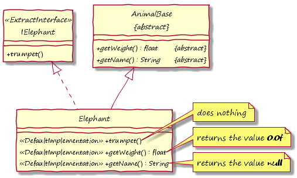

## Traits

### Overview

Extending classes via trait classes is the most powerful feature of the ETAI library. With the traits mechanism, it is possible to directly "inject" methods from so-called **trait classes** into classes beyond regular Java inheritance mechanisms. Thereby, trait classes can also specify and use attributes, i.e., **stateful extension** via trait classes is possible. It feels a little bit like [multiple inheritance](https://en.wikipedia.org/wiki/Multiple_inheritance) known from other languages like C++ and is an adaption of the [Traits](https://en.wikipedia.org/wiki/Trait_(computer_programming)) or [Mixin](https://en.wikipedia.org/wiki/Mixin) concept.

### Basic Usage of Trait Classes

Each regular (Xtend) class can be extended by trait classes besides usual class inheritance. This means that annotated methods of the trait classes will be "injected" into the **extended class**. This happens during code generation of the Java code. Actually, the generated code will call the method of the trait class by using a delegation pattern, i.e., internally an object of trait type is maintained. This way, methods of trait classes can also access and use attributes, which are defined inside the trait class.

A trait class must be declared *abstract* and annotated by ***@TraitClass***. This implicates several effects. First, a mirror interface will be extracted exactly as if *@ExtractInterface* is annotated (cp. [Interface Extraction](#interface-extraction)). Second, trait classes support attributes, but they do not support the specification of non-private, non-static methods and constructors. Non-*private*, non-*static* methods must be so-called **trait methods** and annotated accordingly. There are:

- [Exclusive Methods](#exclusive-methods)
- [Processed Methods](#processed-methods)
- [Required Methods](#required-methods)
- [Envelope Methods](#envelope-methods)

Private or static methods can be used as usual.

Instead of constructors, trait classes must specify so-called **constructor methods** (see [Constructor Methods and Construction Process](#constructor-methods-and-construction-process)). Basically, they are a fifth type of trait method.

In order to extend a class by a trait class, **the mirror interface of the trait class must be included in the list of implemented interfaces** (*implements*) of the class which shall be extended. In addition, the this class must be annotated by ***@ExtendedByAuto***.

The example below shows a class named *Dog* which is extended by trait class *XNamed*. This trait class shall simply offer attribute *name* and the according methods *getName* and *setName* for any class, which is extended by this trait class. In order to extend dog this way, it *implements* the mirror interface *IXNamed*. Therefore it gets *getName* and *setName*, which can be used for any *Dog* object.

Internally, *getName* and *setName* delegate to the methods implemented in *XNamed* via *delegate\$XNamed*. The attribute *name* can logically be considered as part of class *Dog*, but there is no access to it except via getter/setter. The used annotation *@ExclusiveMethod* for the trait methods *getName* and *setName* is explained in [Exclusive Methods](#exclusive-methods). 

##### Input (Code)

```java
package virtual

import org.eclipse.xtend.lib.annotation.etai.ExclusiveMethod
import org.eclipse.xtend.lib.annotation.etai.ExtendedByAuto
import org.eclipse.xtend.lib.annotation.etai.TraitClass

import virtual.intf.IXNamed

abstract class Animal {
    int age
    def int getAge() {age}
    def void setAge(int age) {this.age = age}
    abstract def void move()
}

@TraitClass
abstract class XNamed {

    String name

    @ExclusiveMethod
    override String getName() {name}

    @ExclusiveMethod
    override void setName(String name) {this.name = name}

}

@ExtendedByAuto
class Dog extends Animal implements IXNamed {
	override void move() {/*...*/}
}
```


##### Input (Diagram)


##### Output (Diagram - Logical)

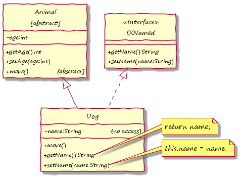

##### Output (Diagram - Technical / Java)

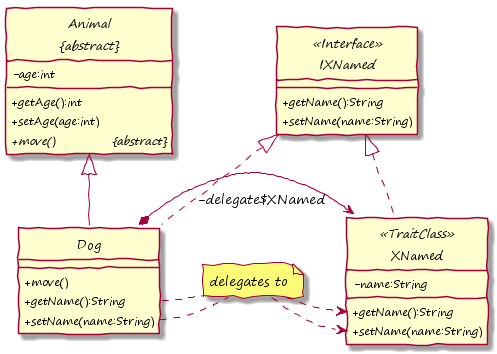

##### Hint

> Historically, the annotation ***@ExtendedBy*** was the only way to apply trait classes. With *@ExtendedBy* such trait classes can explicitly be specified within the annotation itself (*value*). However, it was not possible to enable the usage of Java Generics this way.
>
> Therefore, other possibilities have been investigated including the usage of a string. The easiest way, however, was to request the specification of the mirror interfaces of trait classes via *implements* in addition. The annotation *@ExtendedByAuto* does not demand the specification of any trait class, but it scans the listed interfaces for trait classes (resp. their mirror interfaces) and applies all of them automatically.
>
> **Java Generics are fully supported** now.

### Exclusive Methods

**Exclusive methodes** are the simplest type of trait methods. They are annotated by ***@ExclusiveMethod*** and demand that the **extended class does not have an implementation** of the method, yet. Logically, it can be considered that the exclusive method is simply copied ("injected").

An example can be found in [Basic Usage of Trait Classes](#basic-usage-of-trait-classes). If class *Dog* in that example implemented a method *getName* itself already, there would be an error reported by the active annotation processor.

### Required Methods

Another type of trait methods are **required methods** which are annotated by ***@RequiredMethod***. They must not be implemented and can be considered as a **way to define *abstract* methods** within trait classes and serve a very similar purpose, e.g. the declared method can already be used in algorithms of the trait class.

Primarily, the possibility to specify required methods is just a simplification, because it is not necessary to create and apply additional interfaces. In addition, it is also possible to demand methods, which are not *public*. This cannot be realized via interfaces.

In the example, there are three declarations of required methods within *XFlying*. They can be used in method *fly*, but they must be implemented somewhere in the extended class's hierarchy. This is ensured via different mechanisms, which is why three examples are shown. For *isHealthy* nothing happens during generation, because it is already implemented in the base class *Bird*. The method *getFlyingSpeedFactor* is included in the mirror interface *IXFlying*, which is a base mechanism for *public* trait methods. Finally, there are several cases where implementation must be ensured by generating an *abstract* method in the extended class. Such a scenario is illustrated by the *protected* method *isFledged*, which is included in *Raptor* therefore. Because it is generated with keyword *abstract* there, it must be implemented later on.

##### Input (Code)

```java
package virtual

import org.eclipse.xtend.lib.annotation.etai.ExclusiveMethod
import org.eclipse.xtend.lib.annotation.etai.RequiredMethod
import org.eclipse.xtend.lib.annotation.etai.ExtendedByAuto
import org.eclipse.xtend.lib.annotation.etai.TraitClass

import virtual.intf.IXFlying

abstract class Bird {
	int age
	def protected boolean isHealthy() {true}
	def int getAge() {age}
}

@TraitClass
abstract class XFlying {

	@ExclusiveMethod
	override void fly() {
		if (isHealthy && isFledged && flyingSpeedFactor > 0) {/*...*/}
	}

	@RequiredMethod
	abstract protected def boolean isHealthy()

	@RequiredMethod
	abstract protected def boolean isFledged()
	
	@RequiredMethod
	abstract override double getFlyingSpeedFactor()

}

@ExtendedByAuto
abstract class Raptor extends Bird implements IXFlying {
}


class Eagle extends Raptor {
	override protected boolean isFledged() { age >= 1 }
	override double getFlyingSpeedFactor() { 100.0 }
}
```


##### Input (Diagram)

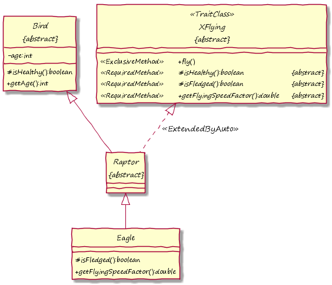

##### Output (Diagram - Logical)

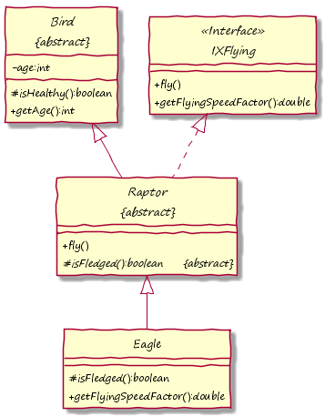

### Processed Methods

**Processed methods** allow that the method is already implemented in the extended class. They must be annotated in the trait class by ***@ProcessedMethod***.

This means that next to the method in the trait class, **the same method might exist in the extended class**. If this is not the case, the method in simply injected (see [Exclusive Methods](#exclusive-methods)). If the method exists in both classes the execution order must be coordinated and the final result based on two return values must be calculated. For that reason, a processed method needs to specify a **trait method processor**. This way it can be defined, if only one of the methods shall be executed or the return value shall be combined, for example.

With such a processor a huge variety of scenarios can be realized. They can be implemented individually (see [Implement Own Trait Method Processor](#implement-own-trait-method-processor)), but there are also standard ones (see [Standard Trait Method Processors](#standard-trait-method-processors)).

#### Standard Trait Method Processors

The following trait method processors are predefined and ready-to-use (package *org.eclipse.xtend.lib.annotation.etai*):

| Trait Method Processor    | Return Type     | Description                                                    |
| ------------------------- |:----------:|---------------------------------------------------------------:|
| ***EPDefault*** | any | If the trait method exists in the extended class, the extended class will override the functionality in the trait class, i.e. the functionality in the trait class just represents a default behavior. |
| ***EPOverride*** | any | The trait method overrides a potential method in the extended class. |
| ***EPVoidPre*** | *void* | The trait method is executed before a potential method in the extended class. |
| ***EPVoidPost*** | *void* | The trait method is executed after a potential method in the extended class. |
| ***EPVoidFinally*** | *void* | The trait method is executed after a potential method in the extended class, even if there has been an exception. |
| ***EPBooleanPreAnd*** | *boolean* | The trait method is executed before a potential method in the extended class. If such a method exists in the extended class, it will only be executed, if the result of the trait method is *true* (short-circuit evaluation). Afterwards, both results are combined via AND operation. |
| ***EPBooleanPostAnd*** | *boolean* | The trait method will only be executed after a potential method in the extended class, if the result of such a method is *true* (short-circuit evaluation). Afterwards, both results are combined via AND operation. If such a method does not exist, only the trait method will be called. |
| ***EPBooleanPreOr*** | *boolean* | The trait method is executed before a potential method in the extended class. If such a method exists in the extended class, it will only be executed, if the result of the trait method is *false* (short-circuit evaluation). Afterwards, both results are combined via OR operation. |
| ***EPBooleanPostOr*** | *boolean* | The trait method will only be executed after a potential method in the extended class, if the result of such a method is *false* (short-circuit evaluation). Afterwards, both results are combined via OR operation. If such a method does not exist, only the trait method will be called. |
| ***EPFirstNotNullPre*** | non-*void* | The functionality of the trait class will be processed first. If there is a result, which is not *null*, this result will be returned immediately. If the result is *null*, the functionality of the extended class (if existing) will be processed afterwards and the latter result will be returned. |
| ***EPFirstNotNullPost*** | non-*void* | The functionality of the extended class (if existing) will be processed first. If there is a result, which is not *null*, this result will be returned immediately. If the result is *null* (or there is no method in the extended class), the functionality of the trait class will be processed afterwards and the latter result will be returned. |
| ***EPExtendedResultPre*** | non-*void* | The functionality of the trait class will be processed first. Afterwards, the functionality of the extended class (if existing) will be processed. The returned result will be the result from the functionality of the extended class, if this functionality exists. Otherwise, the result from the functionality of the trait class will be used. |
| ***EPExtendedResultPost*** | non-*void* | The functionality of the extended class (if existing) will be processed first. Afterwards, the functionality of the trait class will be processed. The returned result will be the result from the functionality of the extended class, if this functionality exists. Otherwise, the result from the functionality of the trait class will be used. |
| ***EPTraitClassResultPre*** | non-*void* | The functionality of the trait class will be processed first. Afterwards, the functionality of the extended class (if existing) will be processed. The returned result will be the result from the functionality of the trait class. The result from the functionality of the extended class will be ignored. |
| ***EPTraitClassResultPost*** | non-*void* | The functionality of the extended class (if existing) will be processed first. Afterwards, the functionality of the trait class will be processed. The returned result will be the result from the functionality of the trait class. The result from the functionality of the extended class will be ignored. |

In the example below, the consequences of three different standard trait method processors is shown.

First of all, the processed methods *getHuntingMethods* and *getHunters* both apply processor *EPDefault*. This means, that *XHunter* specifies two methods representing default behavior, which is used, if the extended class does not specify an own behavior. Therefore, the extended class *Lion* completely applies *getHuntingMethods* from *XHunter*, but uses its own *getHunters* method.

Another possibility is show by processed method *canHunt* which applies *EPBooleanPreAnd*. This way, in context of *Lion* both implementations of *canHunt* (from *XHunter* and *Lion* itself) are logically executed and combined via AND operation.

Finally, the processed method *hunt* shows a possible usage for *void* methods. On call of method *hunt*, the processor *EPVoidPost* ensures, that the implementation of *hunt* within *Lion* is executed first. Afterwards, the implementation of *hunt* within *XHunter* is executed.

##### Input (Code)

```java
package virtual

import org.eclipse.xtend.lib.annotation.etai.EPDefault
import org.eclipse.xtend.lib.annotation.etai.EPVoidPost
import org.eclipse.xtend.lib.annotation.etai.EPBooleanPreAnd
import org.eclipse.xtend.lib.annotation.etai.ExtendedByAuto
import org.eclipse.xtend.lib.annotation.etai.ExtractInterface
import org.eclipse.xtend.lib.annotation.etai.ProcessedMethod
import org.eclipse.xtend.lib.annotation.etai.TraitClass

import virtual.intf.IAnimal
import virtual.intf.IXHunter

@ExtractInterface
abstract class Animal {
	boolean adult
	boolean male
	override boolean isAdult() { adult }
	override boolean isMale() { male }
}

@TraitClass
abstract class XHunter implements IAnimal {

    @ProcessedMethod(processor=EPDefault)
    override String getHuntingMethods() {
        "pursue"
    }

    @ProcessedMethod(processor=EPDefault)
    override String getHunters() {
        "individuals"
    }
    
    @ProcessedMethod(processor=EPBooleanPreAnd)
    override boolean canHunt() {
        isAdult
    }

    @ProcessedMethod(processor=EPVoidPost)
    override void hunt(String prey) {
        System.out.println('''Hunting «prey»...''')
    }

}

@ExtendedByAuto
class Lion extends Animal implements IXHunter {

    override String getHunters() {
        "pack,lioness"
    }
    
    override boolean canHunt() {
        return !isMale
    }

    override void hunt(String prey) {
        System.out.println("Roar!")
    }

}
```


##### Input (Diagram)


##### Output (Diagram - Logical)


#### Implement Own Trait Method Processor

As shown in the previous section, there are some standard processors which cover basic use cases. However, in case of more complex return types and accompanying requirements for combining return values and executing the methods, these use cases might not fit. Then it is necessary to write an own trait method processor.

A trait method processor must implement the interface ***TraitMethodProcessor*** and therefore its method ***call***. If a trait class's method *myMethod* gets annotated by *@ProcessedMethod* together with a trait method processor, the processor's *call* method will get responsible for executing the implementation of *myMethod* in the trait class and the potential implementation in the extended class. So it is wrapping the original implementations. For example, if the implementation of *call* is empty, actually nothing from the original implementations of *myMethod* will be executed.

Method *call* gets two arguments of type ***LazyEvaluation***: ***expressionTraitClass*** and ***expressionExtendedClass***. Both are actually [function objects](https://en.wikipedia.org/wiki/Function_object) which already bind the arguments for calling the original methods. Argument ***expressionExtendedClass* might be *null***, if there is no according method in the extended class. If such a method is required, by the way, it is possible to set attribute *required* of *@ProcessedMethod* to *true* (see [Flag: *required*](#flag-required)).

Objects of type *LazyEvaluation* offer method *eval*. If calling this method for *expressionTraitClass*, the implementation of the original method in the trait class is executed. If calling this method for *expressionExtendedClass*, the implementation of the original method in the extended class is executed. The return value of both executions is returned by *eval* and can be used and modified within *call*. In the end, also ***call* has to return a value**, which then represents the final result.

If the original method has return type *void*, *call* is simply expected to return *null*.

The following code shows an exemplary trait method processor *ProcessorStringCommaSeparated*. It shall execute the original method of the extended class first and the original method of the trait class afterwards. It concatenates both resulting strings with a separating comma in between and returns the concatenated string.

This trait method processor is used for method *getCharacteristics* of all three trait classes *XFlying*, *XTalking* and *XColorful*. Class *Parrot* is extended by these trait classes, so in the end, it gets a method *getCharacteristics* which returns *"flying,talking,colorful"*, i.e. the individual results combined by *ProcessorStringCommaSeparated*.

The example also shows what happens, if multiple trait classes with the same processed method are applied. The extension starts with trait class  *XFlying*. This class logically introduces the first implementation of *getCharacteristics*. Second, *XTalking* is applied, so its method *getCharacteristics* gets combined with the first implementation (via *ProcessorStringCommaSeparated*). Finally, *XColorful* has another implementation of *getCharacteristics*, which again is combined with the combination before (also via *ProcessorStringCommaSeparated*). This represents the final logical behavior of the method *getCharacteristics*, which is injected into *Parrot*. 

##### Input (Code)

```java
package virtual

import org.eclipse.xtend.lib.annotation.etai.ExtendedByAuto
import org.eclipse.xtend.lib.annotation.etai.LazyEvaluation
import org.eclipse.xtend.lib.annotation.etai.ProcessedMethod
import org.eclipse.xtend.lib.annotation.etai.TraitClass
import org.eclipse.xtend.lib.annotation.etai.TraitMethodProcessor

import virtual.intf.IXColorful
import virtual.intf.IXFlying
import virtual.intf.IXTalking

class ProcessorStringCommaSeparated implements TraitMethodProcessor {

	override Object call(
			LazyEvaluation expressionTraitClass,
			LazyEvaluation expressionExtendedClass) {
		if (expressionExtendedClass === null)
			return expressionTraitClass.eval() as String
		else
			return expressionExtendedClass.eval() as String + "," + 
				expressionTraitClass.eval() as String
	}

}

@TraitClass
abstract class XFlying {

	@ProcessedMethod(processor=ProcessorStringCommaSeparated)
	override String getCharacteristics() { "flying"	}

}

@TraitClass
abstract class XTalking {

	@ProcessedMethod(processor=ProcessorStringCommaSeparated)
	override String getCharacteristics() { "hunting" }

}

@TraitClass
abstract class XColorful {

	@ProcessedMethod(processor=ProcessorStringCommaSeparated)
	override String getCharacteristics() { "colorful" }

}

@ExtendedByAuto
class Parrot implements IXFlying, IXTalking, IXColorful {}
```


##### Input (Diagram)


##### Output (Diagram - Logical)

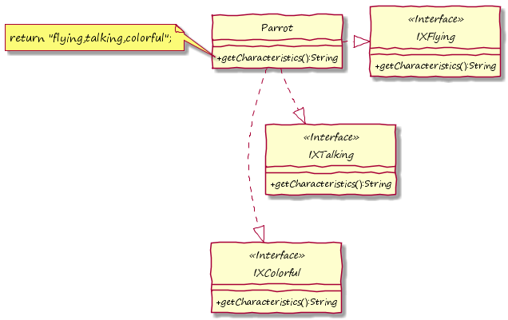

### Envelope Methods

**Envelope methods** are annotated by ***@EnvelopeMethod***. They are similar to processed methods with *EPOverride* as processor (see [Standard Trait Method Processors](#standard-trait-method-processors)). This means, that any matching method of the extended class is overridden/masked by the envelope method. However, with envelope methods **it is possible to explicitly call the overridden method**. For that purpose, an envelope method can call ***method\$extended***, where *method* must be replaced by the actual method name.

In the example below, class *Frog* is shown, which already implements method *eat*. However, the same method is specified by its trait class *XEater*. It is marked as envelope method, so if called for a *Frog* object, the *eat* method of *XEater* will be executed first. However, it calls *eat\$extended*, i.e., also the original *eat* method of *Frog* is executed there. 

##### Input (Code)

```java
package virtual

import org.eclipse.xtend.lib.annotation.etai.EnvelopeMethod
import org.eclipse.xtend.lib.annotation.etai.ExtendedByAuto
import org.eclipse.xtend.lib.annotation.etai.TraitClass

import virtual.intf.IXEater

@TraitClass
abstract class XEater {

	@EnvelopeMethod
	override String eat(String prey) {
		System.out.println('''LOG: start eating: «prey»''')
		val res = eat$extended(prey)
		System.out.println('''LOG: stop eating: «prey»''')
		System.out.println('''LOG: result: «res»''')
		return res
	}

}

@ExtendedByAuto
class Frog implements IXEater {

	override String eat(String prey) {
		if("fly".equals(prey)) "Yummy!" else "Yikes!"
	}

}
```


##### Input (Diagram)


##### Output (Diagram - Logical)


#### Default Value Provider

Applying an envelope method usually requires that the extended class implements a matching method, because the envelope wants to call it (*method\$extended*). However, it might be ok that there is no such method in the extended class. If this is the case, the envelope must specify a **default value provider**. This provider has to provide a (default) value. If the method of the extended class is called, but such a method does not exist, this default value will be queried and used as if it is returned by the method.

The default value provider can be set by parameter ***defaultValueProvider*** of *@EnvelopeMethod*, whereby the potential value is a class. The given class must implement the interface ***DefaultValueProvider&lt;T&gt;***, where *T* can be replaced by the actual type of the provided default value. As a consequence, the class must implement method *getDefaultValue* which just has to return the default value.

An exemplary implementation of a default value provider is shown below. Because *Rabbit* does not implement method *eat*, but the trait class *XEater* calls *eat\$extended*, the default value *"ok"* is returned for a call of *eat*. This resulting value is caused by *StringOkProvider*.

If a default value provider is given, it is also meaningful to set the *required* flag of the *@EnvelopeMethod* annotation to *false* (see [Flag: required](#flag-required)).

##### Input (Code)

```java
package virtual

import org.eclipse.xtend.lib.annotation.etai.EnvelopeMethod
import org.eclipse.xtend.lib.annotation.etai.ExtendedByAuto
import org.eclipse.xtend.lib.annotation.etai.TraitClass
import org.eclipse.xtend.lib.annotation.etai.DefaultValueProvider

import virtual.intf.IXEater

class StringOkProvider implements DefaultValueProvider<String> {

	override String getDefaultValue() { "ok" }

}

@TraitClass
abstract class XEater {

	@EnvelopeMethod(defaultValueProvider=StringOkProvider, required=false)
	override String eat(String prey) {
		System.out.println('''LOG: start eating: «prey»''')
		val res = eat$extended(prey)
		System.out.println('''LOG: stop eating: «prey»''')
		System.out.println('''LOG: result: «res»''')
		return res
	}

}

@ExtendedByAuto
class Rabbit implements IXEater {}
```


##### Input (Diagram)


##### Output (Diagram - Logical)


### Additional Flags for Trait Methods

Some trait method annotations offer additional configuration parameters. They will be explained in the following.

#### Flag: *required*

It is possible for *@ProcessedMethod* and *@EnvelopeMethod* to **demand that the extended class already implements this method**. It is not sufficient, if there is only an abstract method.

In order to activate this demand, the flag ***required*** must be set in the annotation of the trait method.

In certain situations, it is not possible to change the value of this flag. For example, it must be set to *true* in case of *@EnvelopeMethod*, because the envelope method is able to call the method in the extended class. However, if a default value provider is given, it can be set to *false* (cp. [Default Value Provider](#default-value-provider)).

#### Flag: *setFinal*

For *@ExclusiveMethod*, *@ProcessedMethod* and *@EnvelopeMethod* the flag ***setFinal*** can be set. If it is set to *true*, the method **matching method in the extended class will be declared *final***.

Afterwards, the method cannot be overridden any more. This way, the trait class can **ensure that there is no derivation** in context of the extended class. This can be very important for processed methods or envelope methods. In case of *@EnvelopeMethod* the parameter *setFinal* is even set to *true* by default.

Sometimes, a trait method wants to guarantee that it is, for example, executed in the very beginning or the very end (*@ProcessedMethod*) of the whole algorithm, or a trait method wants to wrap the implementation of the extended class (*@EnvelopeMethod*) completely. This can only be guaranteed, if the method is set to *final*.

If it is necessary that child classes influence the functionality of a method, but it has been set to *final*, a possible solution would be to delegate the execution flow to another (internal) method. This pattern and also some more details concerning *setFinal* are shown in the example in [Redirection of Trait Methods](#redirection-of-trait-methods). 

### Redirection of Trait Methods

It is possible to specify **rules so that a trait method is renamed** before it is actually injected into the extended class. This can be done by a feature called **trait method redirection**.

If a method in the extended class is annotated by ***@TraitMethodRedirection***, which specifies a new method name via *String* *value*, each matching trait method will be renamed to this name before it is extending the class. In addition, it will become a new visibility, which is also specified by *@TraitMethodRedirection* via parameter *visibility* (default: *PROTECTED*). 

The redirection directive will be valid for the class in which it actually is set and for derived classes. However, as soon as the annotated method is overridden, the directive will be changed. Either the redirection is deactivated, if there is no *@TraitMethodRedirection* any more, or the values of the new annotation are used.

However, **trait methods can ignore the redirection**. For this, there is a parameter *disableRedirection*, which can be specified together with *@EnvelopeMethod*, *@ProcessedMethod* or *@ExclusiveMethod*. If the flag is set to to *true*, which is the default value for *@EnvelopeMethod*, any setting by *@TraitMethodRedirection* is ignored.

The following example shows redirection together with a use case. Trait class *XMoveLogger* specifies envelope method *move*. Its purpose is to log calls of method *move*. There shall be a log message before and after any other functionality within *move*, i.e. the envelope method must surround everything else. In order to ensure this, the flag *setFinal* is set to *true* (default) in *@EnvelopeMethod* and also redirection is disabled by setting *disableRedirection* to *true*. Because *move* becomes *final* in *Animal*, overriding is not possible any more, so the requirements mentioned above are always fulfilled.

However, it is intended that the functionality of *move* is overridden in child classes, which is why an internal method *moveInternal* is specified and called from within *move*. In case other trait classes want to extend *move* as well, a redirection to *moveInternal* is configured. Therefore, the processed method *move* of *XMoveDigger* adjusts *moveInternal* instead of *move*.

##### Input (Code)

```java
package virtual

import org.eclipse.xtend.lib.annotation.etai.EPVoidPost
import org.eclipse.xtend.lib.annotation.etai.EnvelopeMethod
import org.eclipse.xtend.lib.annotation.etai.ExtendedByAuto
import org.eclipse.xtend.lib.annotation.etai.ProcessedMethod
import org.eclipse.xtend.lib.annotation.etai.TraitClass
import org.eclipse.xtend.lib.annotation.etai.TraitMethodRedirection

import virtual.intf.IXMoveDigger
import virtual.intf.IXMoveLogger

@TraitClass
abstract class XMoveLogger {

	@EnvelopeMethod
	override void move() {
		System.out.println("start moving...")
		move$extended
		System.out.println("stop moving...")
	}

}

@TraitClass
abstract class XMoveDigger {

	@ProcessedMethod(processor=EPVoidPost)
	override void move() {
		System.out.println("digging...")
	}

}

@ExtendedByAuto
abstract class Animal implements IXMoveLogger {

	@TraitMethodRedirection("moveInternal")
	override void move() {
		moveInternal
	}

	def protected void moveInternal() {
		System.out.println("moving...")
	}

}

@ExtendedByAuto
class Mole extends Animal implements IXMoveDigger {

	override protected void moveInternal() {
		super.moveInternal
		System.out.println("through the ground...")
	}

}
```


##### Input (Diagram)


##### Output (Diagram - Logical)

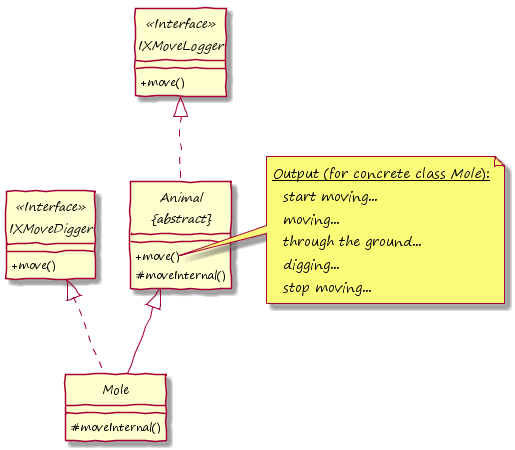

##### Output (Diagram - Technical / Java)

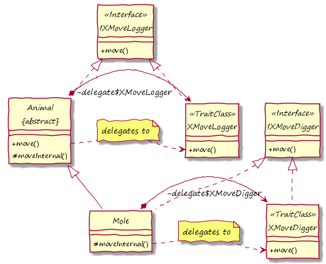

##### Hint

> Redirection allows that an exclusive method is renamed **before** it is checked, if it already exists in the extended class. 

### Constructor Methods and Construction Process

As trait classes can have a state, it might be necessary that this state is initialized as soon as an according object is constructed. Therefore, it is possible to define **constructor methods** by annotating methods in trait classes with ***@ConstructorMethod***. Initialization code can be placed in such methods then.

The name of a constructor method can be chosen freely. It has no impact on the generated code from a logical perspective. However, it must be declared *protected* and non-*static* and have return type *void*.

A constructor method can be thought of as constructor for the trait class, so exactly one constructor method for each trait class **must be called when an object extended by this trait is constructed**. This means that in each constructor of the extended class such a call must exist. There is an **assertion during runtime**, which checks this prerequisite. This requirement is not applicable, of course, if there is no constructor method or only one constructor method without any parameter in a trait class. In the latter case, the constructor method is called automatically at the beginning of processing the object construction.

For calling constructor methods, if applicable, **construction helper methods** are generated within the extended class. They are named ***new\$TraitClass*** where *TraitClass* is the name of the trait class containing the constructor methods. Such a helper method is generated for each constructor method. They are distinguished - exactly like constructors - only by parameters and their major purpose is to call the constructor method of the trait class.

This is also shown in the example below. Trait class *XWithName* specifies two constructor methods. Because *Cat* is extended by this trait class, two construction helper methods named *new\$XWithName* are generated. One of them must be called within each constructor of *Cat*. This is actually done. Attribute *name* gets a value during object construction for sure this way.

##### Input (Code)

```java
package virtual

import org.eclipse.xtend.lib.annotation.etai.ExtendedByAuto
import org.eclipse.xtend.lib.annotation.etai.TraitClass
import org.eclipse.xtend.lib.annotation.etai.ConstructorMethod
import org.eclipse.xtend.lib.annotation.etai.ExclusiveMethod

import virtual.intf.IXWithName

@TraitClass
abstract class XWithName {

	String name

	@ConstructorMethod
	protected def void createWithoutName() { this.name = "*noname*" }

	@ConstructorMethod
	protected def void createWithName(String name) { this.name = name }

	@ExclusiveMethod
	override String getName() { name } 

}

@ExtendedByAuto
class Cat implements IXWithName {
	
	int age

	new() {
		this.age = 0
		new$XWithName()
	}

	new(int age, String name) {
		this.age = age
		new$XWithName(name)
	}

	def int getAge() { age }

}
```


##### Input (Diagram)

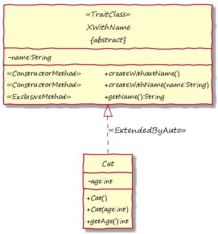

##### Output (Diagram - Logical)


##### Output (Diagram - Technical / Java)

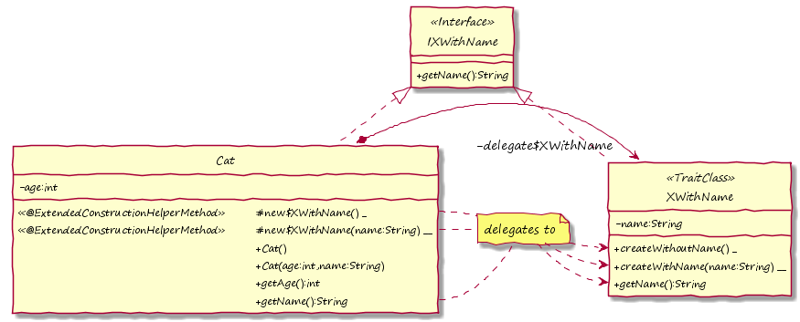

#### Automatic Generation of Constructors

In combination with [adaption features](#automatic-adaption-of-classes) of the ETAI library, there are possibilities to **ease the use of trait classes with construction methods**. The previous section has shown that construction helper methods must be called within constructors of the extended class. Such calls follow a specific pattern very often:

- the construction helper methods are called at the end of the constructor and
- the parameters needed by construction helper methods are added to the constructor's parameter lists and later passed to the construction helper methods.

If this pattern is needed, a **construct rule** can be applied. With this rule no change in the extended class concerning the construction of applied trait classes is required. However, it can only be used in combination with the [generation of factory methods](#generate-factory-methods). The generated factory methods of the extended class (and child classes) will automatically call constructor methods of trait classes, if the extended class is annotated by ***@ConstructRuleAuto***. Also the application of *@ApplyRules* is needed (see [Automatic Adaption of Classes](#automatic-adaption-of-classes)).

Parameters of constructor methods are fully supported by this technique. They are simply added to the generated factory methods. In the trivial case that there is only one constructor method in the trait class and one constructor in the extended class, the parameters of the constructor methods are added to the end of the constructor's parameter list and then transferred to the generated factory method. In cases where multiple constructor methods, multiple (or no) constructors in the extended class or even multiple trait classes exist, cross products are calculated during code generation in order to generate factory methods and their parameter lists. The order of parameters is based on the order of applying trait classes, whereas parameters of the extended class's constructor always start the parameter list.

This is shown in the following example. There are two trait classes *XWithSize* and *XWithName* which require a construction with a *size* and *name* (optional). The extended class *Cat* brings its own constructor with *age* (also optional). In fact, also a base class *Animal* is involved, but it does not affect the principle and therefore is ignored in this textual description.

The mentioned parameters are combined in order to generate the *create* factory methods. There are four factory methods because of the two optional parameters *name* and *age*. One of these factory methods supports the specification of all three parameters *age*, *size* and *name*, of course. All parameters are forwarded to the according implementation.

##### Input (Code)

```java
package virtual

import org.eclipse.xtend.lib.annotation.etai.ApplyRules
import org.eclipse.xtend.lib.annotation.etai.ConstructRuleAuto
import org.eclipse.xtend.lib.annotation.etai.ConstructorMethod
import org.eclipse.xtend.lib.annotation.etai.ExclusiveMethod
import org.eclipse.xtend.lib.annotation.etai.ExtendedByAuto
import org.eclipse.xtend.lib.annotation.etai.FactoryMethodRule
import org.eclipse.xtend.lib.annotation.etai.TraitClass

import virtual.intf.IXWithSize
import virtual.intf.IXWithName

@TraitClass
abstract class XWithSize {

	double size

	@ConstructorMethod
	protected def void createWithSize(double size) { this.size = size }

	@ExclusiveMethod
	override double getSize() { size }

}

@TraitClass
abstract class XWithName {

	String name

	@ConstructorMethod
	protected def void createWithoutName() { this.name = "*noname*" }

	@ConstructorMethod
	protected def void createWithName(String name) { this.name = name }

	@ExclusiveMethod
	override String getName() { name }

}

@ApplyRules
@ConstructRuleAuto
@ExtendedByAuto
@FactoryMethodRule(factoryMethod="create")
abstract class Animal implements IXWithSize {}

@ApplyRules
@ConstructRuleAuto
@ExtendedByAuto
class Cat extends Animal implements IXWithName {

	int age

	new() {
		this.age = 0
	}

	new(int age) {
		this.age = age
	}

	def int getAge() { age }

}
```


##### Input (Diagram)


##### Output (Diagram - Logical)


##### Output (Diagram - Technical / Java)

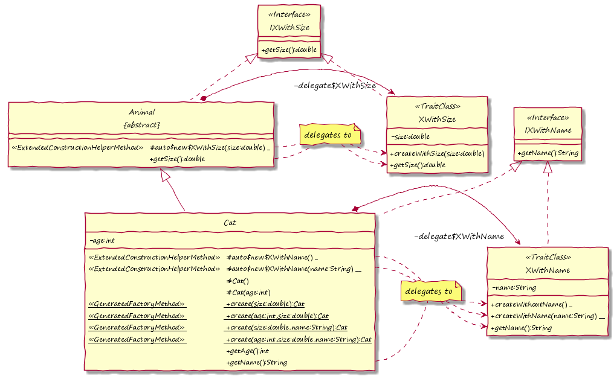

##### Hint

> There are more fine-granular possibilities to control the automatic generation of factory methods as described above. The origin of *@ConstructRuleAuto* is the annotation ***@ConstructRule***. This annotation expects that a list of classes is given by its *value*. The listed classes must be trait classes. For all listed trait classes the extended class and child classes are not expected to call corresponding construction helper methods. Generated factory methods are adapted accordingly (as described above). The annotation *@ConstructRuleAuto* is just a shortcut, which automatically applies these rules for all trait classes which extend the annotated class.
>
> In addition to this, there is the annotation ***@ConstructRuleDisable***. It can be applied, if a construct rule for a specific trait class is active, i.e., factory methods would be adapted in order to call corresponding construction helper methods. This is not a valid use case for classes which apply *@ConstructRule* or *@ConstructRuleAuto*, but for child classes, because construct rules are also inherited. If construction helper methods must be called manually again there, e.g. because calculations must be performed or parameters shall be controlled completely, a construct rule can be disabled for the specified trait classes via *@ConstructRuleDisable* and its *value*.

##### Warning

> Of course, the automatic combination of parameters can lead to ambiguous factory methods. In this case, the described technique cannot be used and construction must be implemented manually. 

### *this* within Trait Classes

Trait classes can be thought of as extension for the class annotating it. Logically, if the annotated class is instantiated, we imagine one created object which contains all traits. It has the type the extended classes and trait classes (or rather their mirror interfaces). Technically, however, the object is composed of multiple sub objects including one object for each trait class (cp. [Basic Usage of Trait Classes](#basic-usage-of-trait-classes)).

#### Calling Methods inside of Trait Classes

Of course, if the keyword *this* is used within methods of trait classes, it will technically not reference the object, we logically construct, but the technical instantiation of the trait class. This can lead to several logical problems, e.g. when calling methods. Due to several internal mechanisms some of these logical problems have been solved.

For example, if a **trait method *methodX* within a trait class *A* calls *this.methodY***, whereas *methodY* is a trait method which is also in *A*, it does not necessarily mean that *methodY* of *A* is called. Imagine that *methodY* in *A* is a default method (cp. [Standard Trait Method Processors](#standard-trait-method-processors)), but the class extended by *A* has its own *methodY* implemented. In this case, it would usually be **expected that *methodY* of the extended class is called**, even if the call is within the trait class.

**The ETAI library can ensure this**. Technically, this is possible by renaming methods and adding helper methods within trait classes during Java code generation.

However, there is a **possibility to call the original method within the trait class explicitly**. This is even necessary in some use cases. For example, if the implementation of a method in the parent class shall be (re-)used. If trait method *methodX* wants to use the implementation of *methodX* in *B*, which is a parent class of *A*, it must call ***super.methodX\$impl*** instead of *super.methodX*. Using the latter usually even ends in an endless recursion. So, only **by adding *\$impl* the real implementation of a trait method can be called** from within a trait class.

The following showcase exemplifies this. Method *attack* within trait class *XPredator* calls *sound*. However, the method *sound* within *XPredator* is not called directly. In case of a *Tiger* object, it actually is called in the end, because *Tiger* does not specify any method. In context of a *Wolf* object, however, the *sound* method of the *Wolf* class is called.

The example also shows that method *sound* in *XPredator* wants to call the base functionality in *XAnimal*. For this it is using *super.attack\$impl*.

##### Input (Code)

```java
package virtual

import org.eclipse.xtend.lib.annotation.etai.ProcessedMethod
import org.eclipse.xtend.lib.annotation.etai.EPDefault
import org.eclipse.xtend.lib.annotation.etai.TraitClass
import org.eclipse.xtend.lib.annotation.etai.ExclusiveMethod
import org.eclipse.xtend.lib.annotation.etai.ExtendedByAuto

import virtual.intf.IXPredator

@TraitClass
abstract class XAnimal {

	@ExclusiveMethod
	override void attack() {
		System.out.println("-attacking-");
	}

}

@TraitClass
abstract class XPredator extends XAnimal {

	@ProcessedMethod(processor=EPDefault)
	override void sound() {
		System.out.println("Roar!")
	}

	@ExclusiveMethod
	override void attack() {
		super.attack$impl
		sound()
	}

}

@ExtendedByAuto
class Wolf implements IXPredator {

	override void sound() {
		System.out.println("Howl!")
	}

}

@ExtendedByAuto
class Tiger implements IXPredator {}
```


##### Input (Diagram)


##### Output (Diagram - Logical)


##### Output (Diagram - Technical / Java)


#### Usage of *\$extendedThis*

It is tricky to perform type checks regarding *this* within trait classes. As described above, *this* does not reference the logical object, which is extended by the trait class.

In order to perform type checks, ***\$extendedThis*** instead of *this* should be used:

| *if (\$extendedThis instanceof Type)* |
|:-------------------------:|

##### Hint

> *\$extendedThis* always references the extended class. Actually, *\$extendedThis* is a generated method with the trait class's mirror interface as return type, because the extended class also implements this interface. The method returns *\$extendedThis\$data* (see example in previous section). This member variable is automatically set accordingly during construction of the object.

### Trait Classes and Inheritance

Trait classes support inheritance and **most known techniques can be used as usual**. For example, it is possible to override trait methods and even changing the type of a trait method is sometimes possible. For example, it is possible to change a trait method from *@ExclusiveMethod* to *@ProcessedMethod*, but not from *@EnvelopeMethod* to anything else.

It is also important to know that **a trait class cannot be applied twice in the hierarchy of extended classes**. This is also a problem, if applied trait classes are not exactly equal, but there is a relationship, e.g. a trait class *A* is derived from trait class *B* (or the other way around). Then, it is not possible to extend a class by *A* and *B* together. 

The following sub sections show some more specifics regarding trait classes and inheritance.

#### Calling Trait Methods of Parent Class within Trait Classes

There is an important rule for calling trait methods in trait parent classes:

- If you want to call *super.method()* within a trait class, use **super.method\$impl** instead. This will apply, **if *method* is a trait method, but not a constructor method**.

The background and more details are explained in [Calling Methods inside of Trait Classes](#calling-methods-inside-of-trait-classes).

#### Base Trait Classes

If a class is declared *abstract* it is not possible to construct corresponding objects. However, writing such classes is still meaningful as some base functionality for derived classes can be implemented there.

This schema is also be applicable for trait classes, i.e. it is possible to declare trait classes with base functionality, but it should not be possible to use them already. The keyword *abstract*, however, is not suitable, because each trait class is declared *abstract* anyways as it should not be possible to construct them.

Therefore, it is possible to set flag *baseClass* in annotation *@TraitClass*. If it is set to *true*, it will not be possible to apply this trait class in order to extend another class. It can only be used as a base in order to derive other trait classes.

#### Trait Classes using Trait Classes

Trait classes can extend regular classes but not other trait classes via *@ExtendedByAuto*. However, there is a concept which solves this issue for the most part.

The ETAI library allows to declare that a **trait class *A* uses another trait class *B***. This way, methods in *B* can be called in context of methods of trait class *A*. This is possible, because it will be ensured that a class, which is extended by trait class *A*, is also extended by *B*. As soon as a class is extended by *A*, there is a check, if the class (or any parent class) has also been extended by *B*. If not, the extension by *B* will automatically be applied. In the end, the logically constructed object contains all required methods, which is why all calls are successful and work as expected. Internally, delegation and redirection of calls are used again. 

In order to specify that a trait class *A* is using trait class *B*, it is necessary for *A* to implement the mirror interfaces of *B* (*implements*), which follows the pattern of extending a regular class by a trait class. Instead of annotating a trait class by *@TraitClass*, it must be annotated by ***@TraitClassAutoUsing***. Of course, using multiple trait classes is supported.

The following example shows how class *Bird* is extended by trait class *XExtendedAttributes*. This trait class uses other trait classes: *XWithSpeed* and *XBasicAttributes*. *XBasicAttributes* again uses other trait classes, which finally results in the fact that *Bird* is extended by *XWithName*, *XWithAge* and *XWithSpeed*. It is also be extended by *XBasicAttributes* and *XExtendedAttributes*, of course, but in the end these trait classes are empty and they represent only an abstraction layer for combining further trait classes. An important fact, however, is that *XWithName* and *XWithAge* have already extended the base class *Animal*, which is why they are technically not extending *Bird* again.

Trait class *XWithSpeed* also shows that it is actually possible to call methods of used trait classes. Method *getSpeed* calls method *getAge*, which is implemented in *XWithAge*. This is possible, because it is ensured that the class which is extended by *XWithSpeed* will also be extended by *XWithAge*, so the corresponding implementation of *getAge* will be available in the constructed object.

##### Input (Code)

```java
package virtual

import org.eclipse.xtend.lib.annotation.etai.ExclusiveMethod
import org.eclipse.xtend.lib.annotation.etai.ExtendedByAuto
import org.eclipse.xtend.lib.annotation.etai.TraitClass
import org.eclipse.xtend.lib.annotation.etai.TraitClassAutoUsing

import virtual.intf.IXBasicAttributes
import virtual.intf.IXExtendedAttributes
import virtual.intf.IXWithAge
import virtual.intf.IXWithName
import virtual.intf.IXWithSpeed

@TraitClass
abstract class XWithName {

	String name

	@ExclusiveMethod
	override String getName() { name }

	@ExclusiveMethod
	override void setName(String name) { this.name = name }

}

@TraitClass
abstract class XWithAge {
	
	int age

	@ExclusiveMethod
	override int getAge() { age }

	@ExclusiveMethod
	override void setAge(int age) { this.age = age }
	
}

@TraitClassAutoUsing
abstract class XWithSpeed implements IXWithAge {
	
	double speed

	@ExclusiveMethod
	override double getSpeed() { if (age < 0 ) 0 else speed }

	@ExclusiveMethod
	override void setSpeed(double speed) { this.speed = speed }
	
}

@TraitClassAutoUsing
abstract class XBasicAttributes implements IXWithName, IXWithAge {}

@TraitClassAutoUsing
abstract class XExtendedAttributes implements IXBasicAttributes, IXWithSpeed {}

@ExtendedByAuto
abstract class Animal implements IXBasicAttributes {}

@ExtendedByAuto
class Bird extends Animal implements IXExtendedAttributes {}
```


##### Input (Diagram)


##### Output (Diagram - Logical)


##### Hint

> Specifying the usage of other trait classes is also possible via parameter *using* of *@TraitClass*. The annotation *@TraitClassAutoUsing* is just a way to avoid a manual declaration by scanning the listed interfaces and using all trait classes found via their mirror interface (cp. with *@ExtendedByAuto* and *@ExtendedBy* in [Basic Usage of Trait Classes](#basic-usage-of-trait-classes)). 
